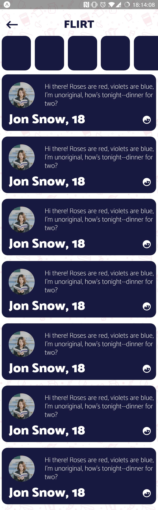
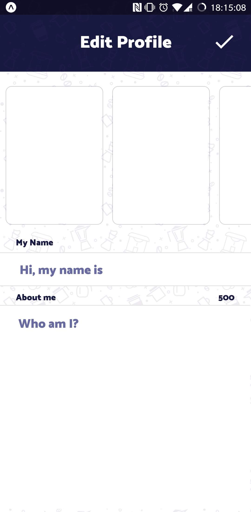
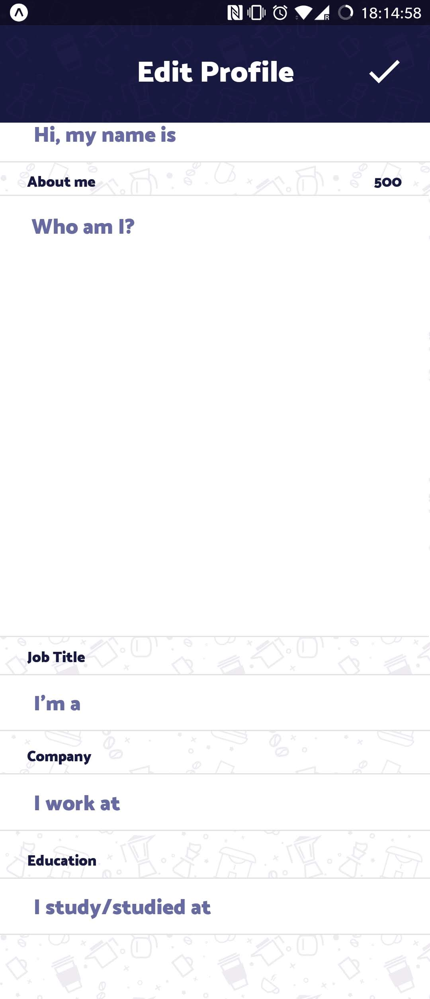
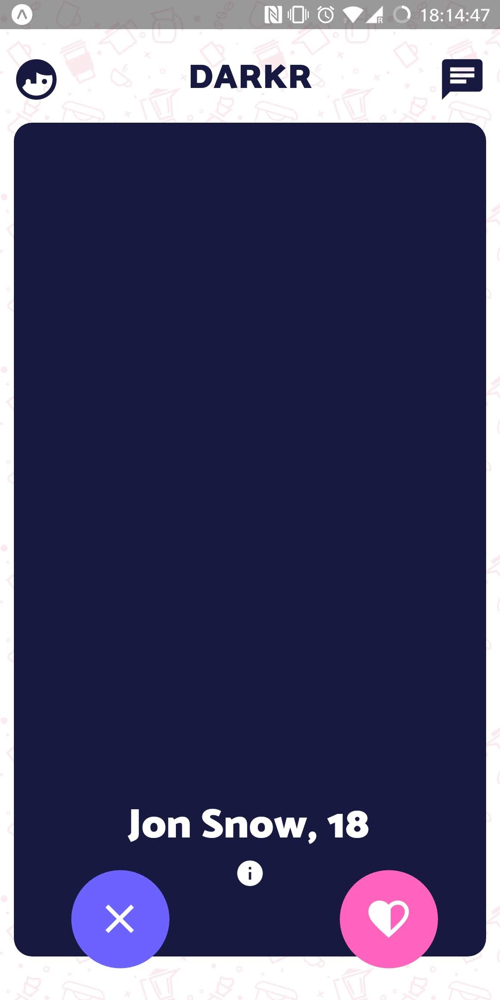
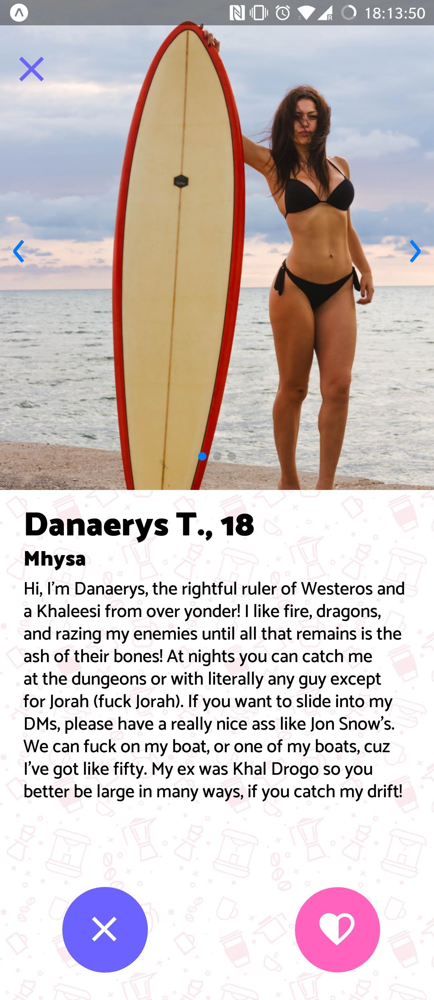
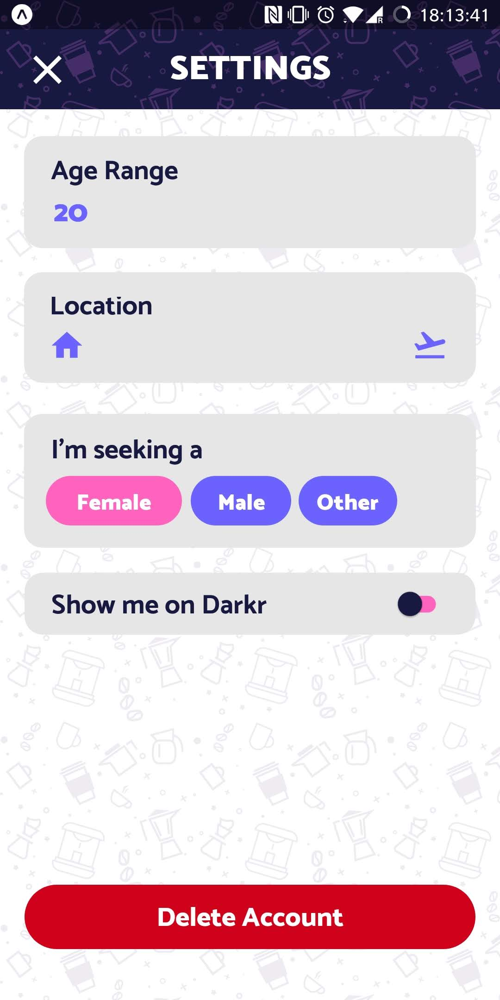
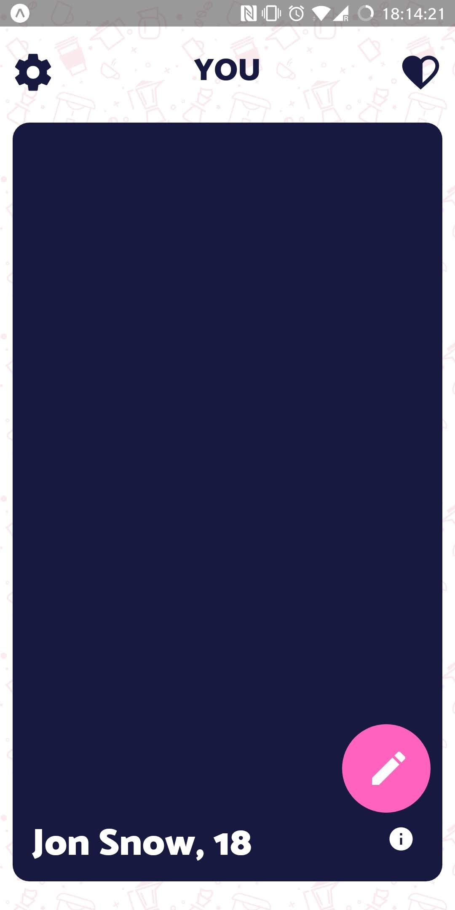

<h1 align="center">DARKR</h1>

An open source React Native Dating App template by Cuffed. Uses modern design elements.
  
  
  
  
  
  
  
  
  
  
  
  
  

Everything is MIT Licensed.

Vector artwork: [Undraw](https://undraw.co)

Pattern BG: [Lukasz Adam](https://lukaszadam.com/illustrations/)

Photos: [Unsplash](https://unsplash.com)

Icons: Material Community Icons (can easily be swapped to Ionicons, Evil, etc. or even Streamline through inject)

Font: Catamaran (downloaded from Google Fonts)